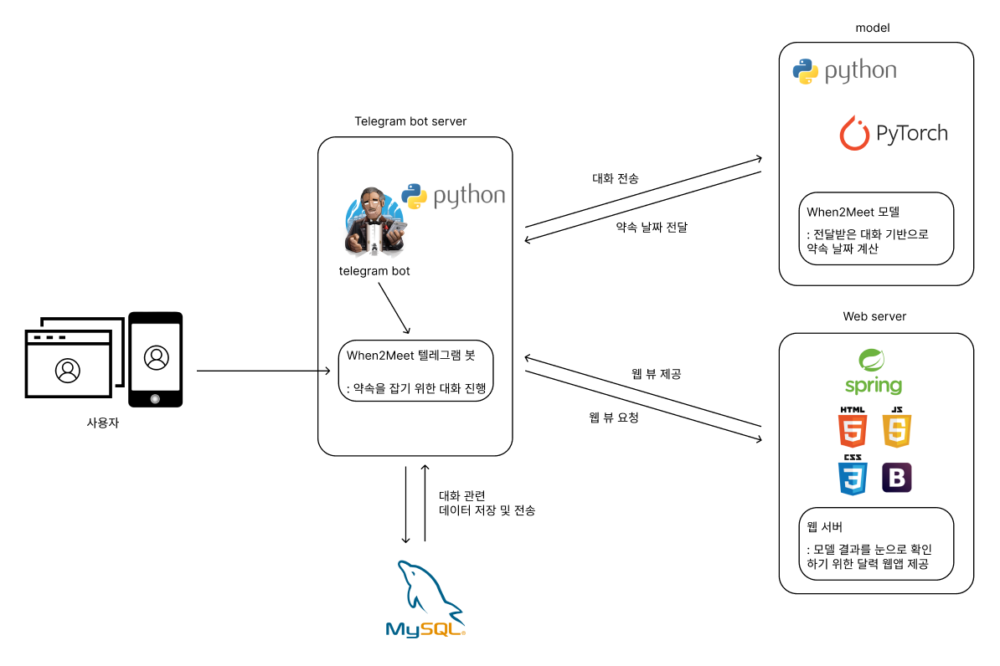

## 졸업프로젝트: when2meet 텔레그램 봇
</img>
- 여러 사람들이 모여 있는 채팅방에서 약속을 정할 때 서로 가능한 시간이 다름
- 대화하는 사람이 많을수록 가능한 스케줄의 교집합을 찾는 것이 힘듦
- 딥러닝을 이용하여 화자 별 스케쥴을 정형화된 날짜 포맷으로 나타냄
- 본 프로젝트를 통해 만들어진 텔레그램 봇은 화자 일정들의 교집합을 찾아내어, 모두에게 가능한 약속시간을 제공
 

## 프로젝트 구조도
</img>
